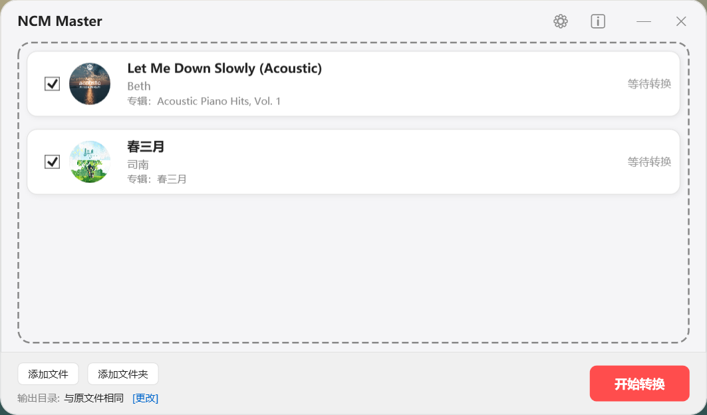
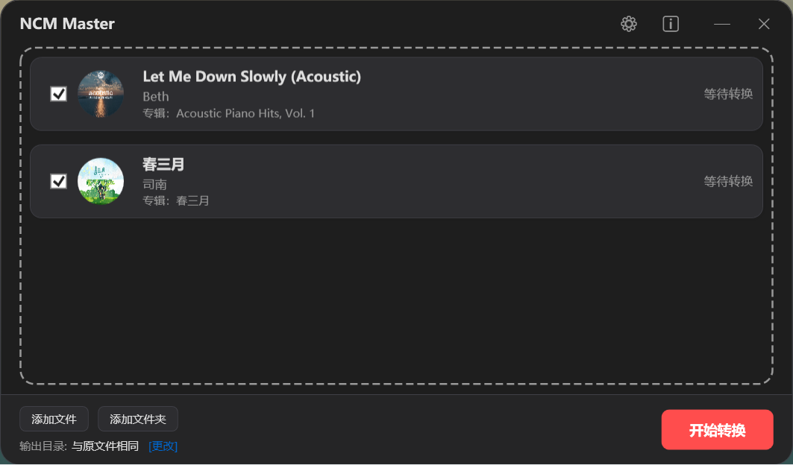

# 🎵 NcmMaster

**NcmMaster** 是一款专为 Windows 10/11用户打造的现代、极致、高效的 NCM 音乐格式处理工具 。与传统NCM格式转换器不同，它不仅能将加密的 NCM 格式还原为无损的 MP3 或 FLAC，更注重用户在处理音乐过程中的视觉与操作体验 。

> **解锁音乐，回归自由。** 本工具仅供个人学习与解码技术研究使用。

------

## ✨ 核心特性

**🚀 极致转换**：支持批量拖拽、整文件夹导入，多线程闪电解密 。

**🎨 颜值即正义**：

- ​	**双主题切换**：支持明亮/暗黑模式，完美契合现代系统审美 。

- ​	**灵动播放器**：内置黑胶唱片旋转动效，转换前可实时试听预览 。

**🌐 国际化支持**：全界面中英文无缝切换，细节打磨至每一个字符 。

**🛠️ 高度自定义**：

- ​	**智能命名**：支持 `%s(曲名)`、`%a(艺术家)`、`%al(专辑)`、`%y(年)` 等十余种变量灵活组合输出文件名 。

- ​	**元数据修复**：自动补全歌曲封面、标题、艺术家及专辑信息 。

**📦 绿色纯净**：

- ​	**单文件运行**：无需安装，不产生系统冗余，配置信息安全存储于 `AppData` 。

- ​	**静默检查更新**：基于 GitHub API，发现新版本时【关于】按钮自动变红提醒 。

------

## 📸 界面预览

| **列表视图 (明亮模式)** | **设置中心 (暗黑模式)** |
| ----------------------- | ----------------------- |
|   |   |

------

## 🚀 如何使用

1. **下载**：前往 [Releases](https://www.google.com/search?q=https://github.com/louis253/NcmMaster/releases) 页面下载最新的 `NcmMaster.exe` 。

2. **导入**：直接将 NCM 文件或整个文件夹拖入程序界面 。

3. **配置**：点击齿轮图标 ⚙️ 设置你喜欢的命名格式和主题 。

4. **转换**：点击右下角的“开始转换”按钮，静待佳音 。

5. **查看**：点击底部的输出路径，即可直接跳转到目标文件夹 。

   

------

## 🛠️ 自定义变量说明

在设置中，你可以使用以下变量来自定义你的文件名 ：

| **变量** | **含义**    | **示例**   |
| -------- | ----------- | ---------- |
| `%s`     | 歌曲名称    | *起风了*   |
| `%a`     | 艺术家/歌手 | *周杰伦*   |
| `%al`    | 专辑名称    | *范特西*   |
| `%o`     | 原始文件名  | *track_01* |
| `%y`     | 当前年份    | *2026*     |
| `%m`     | 当前月份    | 03         |
| `%d`     | 当前日期    | 19         |
| `%t`     | 时间戳      | *225710*   |

------

## 🛠️ 技术栈

- **Language**: VB.NET 

- **UI Framework**: WPF (Windows Presentation Foundation) 

- **Data Serialization**: System.Text.Json 

- **API Interacting**: GitHub REST API 

  

------

## ⚖️ 免责声明

1. 本程序仅供个人技术研究和学习之用，严禁用于任何商业用途 。

2. 请尊重数字内容的版权，转换后的音频文件请于 24 小时内删除。

3. 用户因使用本程序而产生的任何版权纠纷或法律责任，由用户自行承担。

4. 核心解码代码贡献基于 https://github.com/taurusxin/ncmdump 和 https://git.taurusxin.com/taurusxin/ncmdump-go 的 C# 移植版。

   

------

## 🤝 贡献与反馈

如果你喜欢这个项目，欢迎点一个 **Star** ⭐！

如果有任何建议或 Bug，请提交 [Issue](https://www.google.com/search?q=https://github.com/louis253/NcmMaster/issues)。

